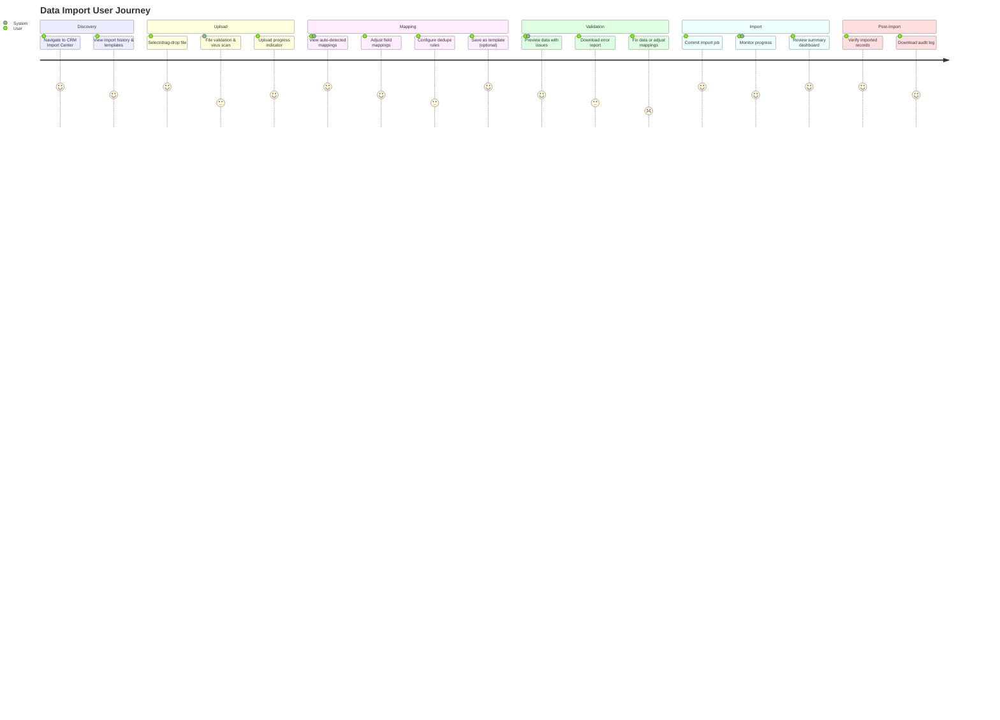
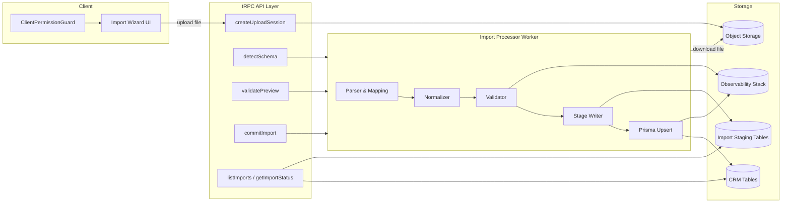
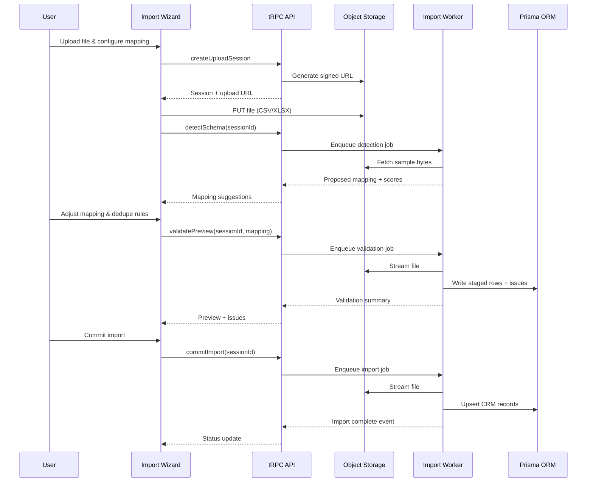
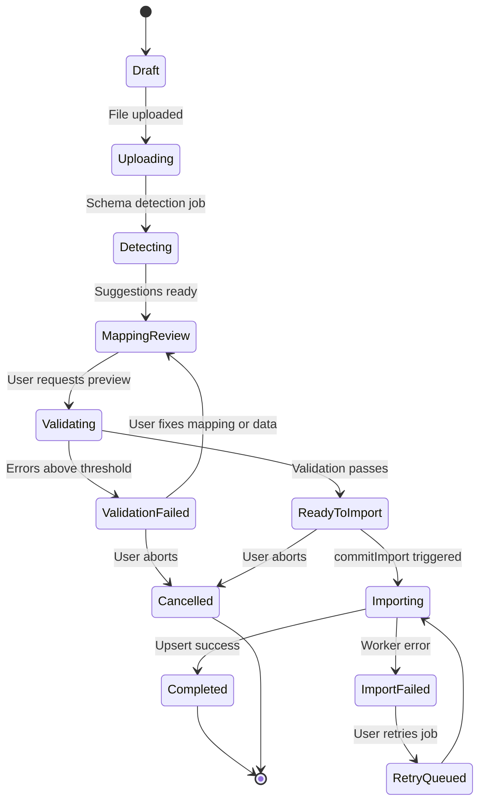

# 📊 Customer Data Import System Design

> **Version:** 1.0  
> **Last Updated:** October 6, 2025  
> **Status:** Design Phase

## Table of Contents

- [Purpose & Outcomes](#1-purpose--outcomes)
- [Scope & Constraints](#2-scope--constraints)
- [Primary Personas & Journeys](#3-primary-personas--journeys)
- [High-Level Architecture](#4-high-level-architecture)
- [Schema Detection & Mapping Intelligence](#5-schema-detection--mapping-intelligence)
- [Data Normalization & Validation Pipeline](#6-data-normalization--validation-pipeline)
- [Import Execution Flow](#7-import-execution-flow)
- [User Experience Details](#8-user-experience-details)
- [Observability & Monitoring](#9-observability--monitoring)
- [Security & Compliance](#10-security--compliance)
- [Implementation Plan](#11-implementation-plan-phased)
- [Testing Strategy](#12-testing-strategy)
- [Tooling & Dependencies](#13-tooling--dependencies)
- [Risks & Mitigations](#14-risks--mitigations)
- [Open Questions](#15-open-questions)

---

## 1. Purpose & Outcomes

### 🎯 Primary Goals

- **Frictionless Data Migration**: Enable organization admins to ingest CRM-related records (contacts, companies, deals) from CSV or Excel files without schema-level friction
- **Intelligent Mapping**: Provide guided field mapping with AI-assisted suggestions, robust data normalization, and transparent validation feedback
- **Reusability & Speed**: Allow reuse of saved mapping templates and support partial imports to accelerate recurring data loads
- **Auditability**: Maintain complete audit trails for compliance and troubleshooting

### 📈 Success Metrics

- **Import Success Rate**: >95% of imports complete without critical errors
- **Time to First Import**: Users complete their first import in <5 minutes
- **Mapping Accuracy**: Auto-detection achieves >80% field mapping accuracy
- **User Satisfaction**: >4.5/5 rating for import experience

---

## 2. Scope & Constraints

### ✅ In Scope (v1.0)

- **CRM Module Support**:
  - Contacts (leads, customers)
  - Organizations (companies, accounts)
  - Deals (opportunities, pipeline stages)
- **Core Features**:
  - CSV and Excel (XLSX) file support
  - Intelligent field mapping with AI suggestions
  - Data validation and normalization
  - Deduplication workflows (skip, update, create)
  - Staged imports with preview
  - Mapping template management
  - Detailed error reporting and logs

### 🔮 Future Scope (Post v1.0)

- Additional modules: HR (employees, payroll), Finance (transactions, expenses)
- Automated scheduled imports
- External storage connectors (Google Drive, OneDrive, Dropbox)
- API-based imports from external systems
- Advanced data transformation rules engine
- Bulk update/delete operations

### ⚙️ Technical Constraints

- **Runtime**: Bun for performance-critical operations
- **Framework**: Next.js 15 App Router with tRPC
- **Database**: PostgreSQL with Prisma ORM
- **Multi-tenancy**: Organization-scoped data isolation
- **Authentication**: Existing RBAC framework (`crm:write` permission required)
- **File Limits**: 10 MB per file (configurable), 100,000 rows recommended max
- **Supported Formats**: CSV (UTF-8, UTF-16), XLSX (Excel 2007+)

---

## 3. Primary Personas & Journeys

### 👥 User Personas

#### 🏢 Organization Owner / Admin

- **Context**: Migrating from legacy CRM or consolidating multiple data sources
- **Goals**: Bulk load thousands of records quickly and accurately
- **Pain Points**: Complex data transformations, unclear error messages
- **Expectations**: AI-assisted mapping, clear validation feedback, rollback capability

#### 💼 Power User / Sales Manager

- **Context**: Regular data updates from external sources (marketing campaigns, events)
- **Goals**: Recurring imports with minimal setup time
- **Pain Points**: Repetitive manual mapping, dealing with duplicates
- **Expectations**: Saved templates, smart duplicate handling, scheduling capability

#### 🛠️ Support Engineer / Technical Admin

- **Context**: Troubleshooting failed imports for team members
- **Goals**: Quick diagnosis and resolution of import issues
- **Pain Points**: Insufficient logging, inability to replay failed imports
- **Expectations**: Detailed audit logs, error replay, data validation tools

### 🗺️ End-to-End User Journey



#### Detailed Journey Steps

1. **📤 Upload**: User navigates to CRM Import Center and uploads CSV/XLSX file via drag-drop or file picker
2. **🧠 Auto-Detection**: System analyzes file structure, infers column semantics, and proposes mappings to CRM fields with confidence scores
3. **🎯 Mapping Review**: User reviews/edits mappings, selects deduplication strategy, and optionally saves configuration as a template
4. **✅ Validation**: System highlights issues (missing required fields, invalid emails, enum mismatches) with actionable correction suggestions
5. **⚡ Processing**: Import job executes asynchronously, writing to staging tables, then to production tables once validated
6. **📊 Results**: User reviews results dashboard showing success counts, warnings, and downloadable error reports

---

## 4. High-Level Architecture

### 🏗️ System Components

#### 1. 🖥️ Client Layer (Next.js App Router)

**Location**: `src/components/crm/import-wizard/`

- **Import Wizard Component**
  - Multi-step form with resumable state
  - Local storage for draft persistence
  - Server-side session backup
  - Mobile-responsive design with `max-h-[90vh] overflow-y-auto`
- **Permission Guards**
  - `ClientPermissionGuard` with `crm:write` requirement
  - Role-based feature visibility
- **File Upload Interface**
  - Drag-and-drop support
  - Signed URL upload to object storage
  - Progressive upload feedback with chunking
  - Client-side file validation (type, size)
- **Mapping Editor**
  - Visual field mapping interface
  - Auto-detected suggestions with confidence badges
  - Saved template selector and editor
  - Real-time validation indicators

#### 2. 🔌 tRPC API Layer

**Location**: `src/server/api/routers/crm/import.ts`

| Procedure             | Purpose                   | Input                                | Output                                             |
| --------------------- | ------------------------- | ------------------------------------ | -------------------------------------------------- |
| `createUploadSession` | Initialize import session | `{ fileName, fileSize, orgId }`      | `{ sessionId, uploadUrl, expiresAt }`              |
| `detectSchema`        | Analyze file structure    | `{ sessionId }`                      | `{ fields[], mappingSuggestions[], confidence[] }` |
| `validatePreview`     | Validate mapped data      | `{ sessionId, mapping, dedupeMode }` | `{ preview[], issues[], stats }`                   |
| `commitImport`        | Execute import job        | `{ sessionId }`                      | `{ jobId, estimatedDuration }`                     |
| `listImports`         | List import history       | `{ orgId, status?, limit }`          | `{ imports[], totalCount }`                        |
| `getImportStatus`     | Poll job status           | `{ sessionId }`                      | `{ status, progress, rowsProcessed }`              |
| `saveTemplate`        | Save mapping config       | `{ name, mapping, orgId }`           | `{ templateId }`                                   |
| `listTemplates`       | List saved templates      | `{ orgId }`                          | `{ templates[] }`                                  |

#### 3. ⚙️ Background Workers

**Location**: `scripts/workflow-scheduler-worker.ts` (extended)

- **Import Processor Queue**
  - Dedicated queue using existing workflow dispatcher
  - Concurrency controls per organization (max 2 concurrent imports)
  - Priority-based job scheduling
- **Processing Pipeline**
  ```
  Download File → Parse → Apply Mapping → Normalize →
  Validate → Stage → Upsert → Emit Events → Cleanup
  ```
- **Job Types**
  - `SCHEMA_DETECTION`: Analyze file and suggest mappings
  - `VALIDATION`: Preview validation without committing
  - `IMPORT_EXECUTION`: Full import to production tables
  - `ROLLBACK`: Undo recently completed import

#### 4. 💾 Persistence Layer

**Prisma Models** (to be created):

```typescript
model ImportSession {
  id              String   @id @default(cuid())
  organizationId  String
  createdByUserId String
  fileName        String
  fileSize        Int
  fileUrl         String
  fileChecksum    String?
  rowCount        Int?
  status          ImportStatus
  module          ImportModule // CRM, HR, FINANCE
  entityType      String // Contact, Organization, Deal
  mappingConfig   Json?
  dedupeMode      DedupeMode
  createdAt       DateTime @default(now())
  updatedAt       DateTime @updatedAt
  completedAt     DateTime?
  // Relations
  organization    Organization @relation(fields: [organizationId])
  createdBy       User @relation(fields: [createdByUserId])
  rows            ImportRow[]
  issues          ImportRowIssue[]
}

model ImportTemplate {
  id             String   @id @default(cuid())
  organizationId String
  name           String
  module         ImportModule
  entityType     String
  mappingConfig  Json
  columnSignature Json // For auto-detection
  usageCount     Int @default(0)
  createdAt      DateTime @default(now())
  // Relations
  organization   Organization @relation(fields: [organizationId])
}

model ImportRow {
  id        String   @id @default(cuid())
  sessionId String
  rowNumber Int
  rawData   Json
  mappedData Json?
  status    RowStatus // PENDING, VALIDATED, IMPORTED, FAILED, SKIPPED
  // Relations
  session   ImportSession @relation(fields: [sessionId])
  issues    ImportRowIssue[]
}

model ImportRowIssue {
  id        String   @id @default(cuid())
  sessionId String
  rowId     String
  field     String
  severity  IssueSeverity // ERROR, WARNING
  message   String
  hint      String?
  // Relations
  session   ImportSession @relation(fields: [sessionId])
  row       ImportRow @relation(fields: [rowId])
}
```

**Enums**:

```typescript
enum ImportStatus {
  DRAFT,
  UPLOADING,
  DETECTING,
  MAPPING_REVIEW,
  VALIDATING,
  VALIDATION_FAILED,
  READY_TO_IMPORT,
  IMPORTING,
  COMPLETED,
  IMPORT_FAILED,
  CANCELLED,
  RETRY_QUEUED,
}

enum DedupeMode {
  SKIP,
  UPDATE,
  CREATE,
}

enum RowStatus {
  PENDING,
  VALIDATED,
  IMPORTED,
  FAILED,
  SKIPPED,
}

enum IssueSeverity {
  ERROR,
  WARNING,
}
```

**Object Storage**:

- Uploaded files stored with metadata (location, checksum, detection version)
- Signed URLs with 1-hour expiration for security
- Automatic cleanup after 30 days (configurable)
- Virus scanning via ClamAV before processing

### Architecture Overview Diagram



## 5. Schema Detection & Mapping Intelligence

### 📖 Parsing Layer

**Libraries**:

- **CSV**: `papaparse` with streaming support for large files
- **Excel**: `xlsx` (SheetJS) for XLSX/XLS formats
- **Encoding**: Auto-detection of UTF-8, UTF-16, ISO-8859-1

**Sampling Strategy**:

- Analyze first 200 rows for pattern detection
- Sample additional random rows for large files (>10,000 rows)
- Detect header row (first non-empty row with unique values)

### 🧠 Intelligent Detection Algorithm

#### Step 1: Header Normalization

```typescript
function normalizeHeader(raw: string): string {
  return raw
    .trim()
    .toLowerCase()
    .replace(/[^a-z0-9]/g, "")
    .replace(/\s+/g, "");
}
```

#### Step 2: Canonical Field Dictionary

| OpenSyte Field | Common Variations                             | Data Type Hints           |
| -------------- | --------------------------------------------- | ------------------------- |
| `firstName`    | first_name, fname, forename, given_name       | Text, 2-50 chars          |
| `lastName`     | last_name, lname, surname, family_name        | Text, 2-50 chars          |
| `email`        | email_address, e-mail, mail                   | Email regex pattern       |
| `phone`        | phone_number, telephone, mobile, cell         | Phone patterns            |
| `companyName`  | company, organization, org_name, business     | Text, unique              |
| `dealValue`    | amount, value, deal_amount, opportunity_value | Numeric, currency         |
| `dealStage`    | stage, status, pipeline_stage                 | Enum from predefined list |
| `createdDate`  | created_at, date_created, signup_date         | Date/DateTime             |

#### Step 3: Confidence Scoring Algorithm

```typescript
interface FieldScore {
  sourceColumn: string;
  targetField: string;
  confidence: number; // 0-100
  reasons: string[];
}

function calculateConfidence(
  sourceColumn: string,
  sampleData: any[]
): FieldScore[] {
  const scores: FieldScore[] = [];

  for (const targetField of CRM_FIELDS) {
    let confidence = 0;
    const reasons: string[] = [];

    // Header similarity (40 points max)
    const headerSim = levenshteinSimilarity(
      normalizeHeader(sourceColumn),
      normalizeHeader(targetField.name)
    );
    confidence += headerSim * 40;
    if (headerSim > 0.7)
      reasons.push(`Header match: ${(headerSim * 100).toFixed(0)}%`);

    // Data type compatibility (40 points max)
    const typeMatch = checkTypeCompatibility(sampleData, targetField.type);
    confidence += typeMatch * 40;
    if (typeMatch > 0.8) reasons.push(`Data type matches ${targetField.type}`);

    // Uniqueness hints (20 points max)
    const uniqueness = calculateUniqueness(sampleData);
    if (targetField.unique && uniqueness > 0.9) {
      confidence += 20;
      reasons.push("Unique values detected");
    }

    scores.push({
      sourceColumn,
      targetField: targetField.name,
      confidence,
      reasons,
    });
  }

  return scores.sort((a, b) => b.confidence - a.confidence);
}
```

#### Step 4: Composite Field Detection

| Pattern Detected                        | Transformation Suggestion                   |
| --------------------------------------- | ------------------------------------------- |
| Single "Full Name" column               | Split into `firstName` + `lastName`         |
| "Address" column                        | Parse into `street`, `city`, `state`, `zip` |
| Concatenated ID (e.g., "DEAL-2024-001") | Extract prefix/suffix patterns              |
| Multi-select text ("tag1, tag2")        | Convert to array field                      |

#### Step 5: Mapping Suggestions

- **High Confidence (>80%)**: Auto-map with green badge 🟢
- **Medium Confidence (50-80%)**: Suggest with yellow badge 🟡
- **Low Confidence (<50%)**: Mark as "Needs Review" 🔴
- **Ties**: Present multiple options for user selection

### 💾 Template Reuse System

**Template Storage**:

```typescript
interface MappingTemplate {
  name: string;
  columnSignature: {
    headers: string[]; // Normalized headers
    types: DataType[]; // Inferred types
    fingerprint: string; // Hash for quick matching
  };
  mapping: Record<string, string>; // source -> target
  transformations: {
    field: string;
    rule: TransformRule;
  }[];
}
```

**Auto-Suggestion Logic**:

1. Calculate fingerprint of uploaded file's columns
2. Find templates with >70% column overlap
3. Present best-matching templates to user
4. Allow one-click application with review step

---

## 6. Data Normalization & Validation Pipeline

### 🧽 Normalization Rules

#### Text Fields

```typescript
function normalizeText(value: string, field: FieldConfig): string {
  let normalized = value.trim();

  switch (field.casing) {
    case "title":
      return titleCase(normalized);
    case "upper":
      return normalized.toUpperCase();
    case "lower":
      return normalized.toLowerCase();
    default:
      return normalized;
  }
}
```

#### Date & Time

```typescript
function normalizeDate(value: string): Date | null {
  const formats = [
    "YYYY-MM-DD",
    "MM/DD/YYYY",
    "DD/MM/YYYY",
    "YYYY-MM-DD HH:mm:ss",
    "ISO8601",
  ];

  for (const format of formats) {
    const parsed = parseDate(value, format);
    if (parsed.isValid()) return parsed.toISOString();
  }

  return null;
}
```

#### Phone Numbers

```typescript
import { parsePhoneNumber } from "libphonenumber-js";

function normalizePhone(value: string, defaultCountry = "US"): string | null {
  try {
    const phoneNumber = parsePhoneNumber(value, defaultCountry);
    return phoneNumber.isValid() ? phoneNumber.format("E.164") : null;
  } catch {
    return null;
  }
}
```

#### Currency

```typescript
function normalizeCurrency(value: string): number | null {
  // Remove currency symbols and separators
  const cleaned = value.replace(/[^0-9.-]/g, "");
  const parsed = parseFloat(cleaned);
  return isNaN(parsed) ? null : parsed;
}
```

### ✅ Validation Rules Engine

#### Rule Types

| Rule Type   | Description                 | Example                             |
| ----------- | --------------------------- | ----------------------------------- |
| `required`  | Field must have a value     | Email is required for contacts      |
| `email`     | Must match email regex      | `user@example.com`                  |
| `phone`     | Must be valid phone format  | `+1-555-123-4567`                   |
| `url`       | Must be valid URL           | `https://example.com`               |
| `enum`      | Must be in predefined list  | Deal stage: Lead, Qualified, Closed |
| `range`     | Numeric value within bounds | Deal value: $0 - $1,000,000         |
| `length`    | String length constraints   | Name: 2-100 characters              |
| `pattern`   | Custom regex pattern        | Custom ID format                    |
| `unique`    | No duplicates in dataset    | Email must be unique                |
| `reference` | Foreign key exists          | Deal owner must be existing user    |

#### Validation Implementation

```typescript
interface ValidationRule {
  field: string;
  type: RuleType;
  severity: "error" | "warning";
  params?: Record<string, any>;
  message: string;
  hint?: string;
}

function validateRow(
  row: Record<string, any>,
  rules: ValidationRule[]
): ValidationIssue[] {
  const issues: ValidationIssue[] = [];

  for (const rule of rules) {
    const value = row[rule.field];
    const result = applyRule(value, rule);

    if (!result.valid) {
      issues.push({
        field: rule.field,
        severity: rule.severity,
        message: rule.message,
        hint: rule.hint ?? suggestFix(value, rule),
        currentValue: value,
        suggestedValue: result.suggestion,
      });
    }
  }

  return issues;
}
```

### 🔄 Deduplication Strategies

| Strategy   | Behavior                             | Use Case                                  |
| ---------- | ------------------------------------ | ----------------------------------------- |
| **SKIP**   | Ignore duplicate rows                | Initial migration, preserve existing data |
| **UPDATE** | Merge new data into existing records | Periodic updates, enrich existing records |
| **CREATE** | Always create new records            | Event logs, transaction history           |

**Duplicate Detection Keys**:

- **Contacts**: Email address (primary), Phone + Name (fallback)
- **Organizations**: Company name + domain (primary), Tax ID (fallback)
- **Deals**: External ID (primary), Name + Organization (fallback)

### 📊 Preview & Feedback

**Aggregated Statistics**:

```typescript
interface ValidationSummary {
  totalRows: number;
  validRows: number;
  rowsWithErrors: number;
  rowsWithWarnings: number;
  duplicatesDetected: number;
  estimatedImportTime: string;

  issueBreakdown: {
    field: string;
    errorCount: number;
    warningCount: number;
    commonIssue: string;
  }[];
}
```

**Error Report Export**:

- CSV format with original data + issue annotations
- Color-coded columns for severity
- Suggested fixes in adjacent column
- Import back after corrections

---

## 7. Import Execution Flow

### ⚡ Worker Pipeline Architecture

```typescript
class ImportWorker {
  async processImport(sessionId: string) {
    const session = await this.fetchSession(sessionId);

    try {
      // Step 1: Download & Initialize
      const fileStream = await this.downloadFile(session.fileUrl);
      const parser = this.createParser(session.fileName);

      // Step 2: Stream Processing
      const processor = new StreamProcessor({
        batchSize: 500,
        maxConcurrency: 4,
        onProgress: progress => this.updateProgress(sessionId, progress),
      });

      await processor.process(fileStream, async batch => {
        // Step 3: Transform & Normalize
        const mapped = batch.map(row =>
          this.applyMapping(row, session.mappingConfig)
        );
        const normalized = mapped.map(row => this.normalize(row));

        // Step 4: Validate
        const validated = await this.validate(
          normalized,
          session.validationRules
        );

        // Step 5: Stage
        await this.stageRows(sessionId, validated);

        // Step 6: Upsert (if validation passes threshold)
        if (this.meetsQualityThreshold(validated)) {
          await this.upsertToProduction(validated, session.dedupeMode);
        }
      });

      // Step 7: Finalize
      await this.finalizeImport(sessionId);
      this.emitEvent("import.completed", { sessionId });
    } catch (error) {
      await this.handleError(sessionId, error);
      this.emitEvent("import.failed", { sessionId, error });
    }
  }
}
```

### 🔄 Processing Stages

#### Stage 1: Download & Parse

- Fetch file from object storage
- Initialize streaming parser
- Detect encoding if not specified
- Estimate total rows for progress tracking

#### Stage 2: Mapping Transform

- Apply column mappings from configuration
- Execute composite field splits/merges
- Handle missing columns (use defaults or mark as error)

#### Stage 3: Normalization

- Apply field-specific normalization rules
- Trim whitespace, standardize formatting
- Convert data types (dates, numbers, booleans)
- Phone/email/URL standardization

#### Stage 4: Validation

- Run all validation rules per row
- Accumulate issues by row and field
- Calculate quality score per row
- Determine if row is importable

#### Stage 5: Staging

- Write to `ImportRow` table in batches
- Link issues to `ImportRowIssue` table
- Maintain transaction boundaries
- Update progress metrics

#### Stage 6: Production Upsert

```typescript
async function upsertBatch(rows: ValidatedRow[], mode: DedupeMode) {
  return await db.$transaction(async tx => {
    for (const row of rows) {
      if (mode === "SKIP") {
        const existing = await tx.contact.findUnique({
          where: { email: row.email },
        });
        if (existing) continue;
      }

      await tx.contact.upsert({
        where: { email: row.email },
        create: row.data,
        update: mode === "UPDATE" ? row.data : {},
      });
    }
  });
}
```

#### Stage 7: Cleanup & Events

- Mark session as `COMPLETED` or `IMPORT_FAILED`
- Generate summary statistics
- Emit analytics events
- Schedule file cleanup (after retention period)

### 🚨 Error Handling

| Error Type             | Handling Strategy                                      |
| ---------------------- | ------------------------------------------------------ |
| **Parse Error**        | Skip malformed rows, continue processing               |
| **Validation Failure** | Accumulate issues, proceed if <20% error rate          |
| **Database Error**     | Rollback transaction, mark session failed, allow retry |
| **Network Error**      | Retry with exponential backoff (3 attempts)            |
| **Timeout**            | Pause job, allow resume from last checkpoint           |

### 📊 Progress Tracking

```typescript
interface ImportProgress {
  sessionId: string;
  status: ImportStatus;
  phase: "parsing" | "validating" | "importing";
  rowsProcessed: number;
  rowsTotal: number;
  rowsSuccessful: number;
  rowsFailed: number;
  rowsSkipped: number;
  startedAt: Date;
  estimatedCompletionAt: Date;
  throughputRowsPerSecond: number;
}
```

### Execution Sequence Diagram



## 8. User Experience Details

### 🎨 Import Wizard UI Flow

#### Step 1: Upload

```tsx
<UploadStep>
  <FileDropzone
    accept=".csv,.xlsx"
    maxSize={10 * 1024 * 1024}
    onDrop={handleUpload}
  />
  <TemplateSelector templates={savedTemplates} onSelect={applyTemplate} />
</UploadStep>
```

#### Step 2: Field Mapping

```tsx
<MappingStep>
  <MappingGrid>
    {sourceColumns.map(col => (
      <MappingRow>
        <SourceColumn>{col.name}</SourceColumn>
        <ConfidenceBadge score={col.confidence} />
        <TargetFieldSelect
          value={col.mappedTo}
          options={crmFields}
          onChange={updateMapping}
        />
        <TransformPreview data={col.sampleData} />
      </MappingRow>
    ))}
  </MappingGrid>
  <DedupeSettings />
  <SaveTemplateButton />
</MappingStep>
```

#### Step 3: Validation Preview

```tsx
<ValidationStep>
  <SummaryCards>
    <Card icon="✅" label="Valid Rows" value={stats.validRows} />
    <Card
      icon="⚠️"
      label="Warnings"
      value={stats.warnings}
      severity="warning"
    />
    <Card icon="❌" label="Errors" value={stats.errors} severity="error" />
    <Card icon="🔄" label="Duplicates" value={stats.duplicates} />
  </SummaryCards>

  <IssuesTable
    data={previewData}
    onRowClick={showDetails}
    filters={["errors", "warnings", "all"]}
  />

  <ActionBar>
    <DownloadErrorsButton />
    <BackToMappingButton />
    <ProceedButton disabled={stats.errors > threshold} />
  </ActionBar>
</ValidationStep>
```

#### Step 4: Import Execution

```tsx
<ImportingStep>
  <ProgressBar
    value={progress.rowsProcessed}
    max={progress.rowsTotal}
    label={`${progress.rowsProcessed} / ${progress.rowsTotal} rows`}
  />

  <LiveStats>
    <Stat label="Success" value={progress.rowsSuccessful} color="green" />
    <Stat label="Failed" value={progress.rowsFailed} color="red" />
    <Stat label="Skipped" value={progress.rowsSkipped} color="gray" />
  </LiveStats>

  <StatusMessage>{progress.phase}</StatusMessage>
</ImportingStep>
```

#### Step 5: Summary & Results

```tsx
<SummaryStep>
  <ResultHeader status={session.status} />

  <MetricsGrid>
    <Metric label="Total Rows" value={session.rowCount} />
    <Metric label="Imported" value={session.successCount} />
    <Metric label="Failed" value={session.failureCount} />
    <Metric label="Duration" value={formatDuration(session.duration)} />
  </MetricsGrid>

  <ActionButtons>
    <ViewImportedDataButton />
    <DownloadAuditLogButton />
    <StartNewImportButton />
  </ActionButtons>
</SummaryStep>
```

### ♿ Accessibility Features

- **Keyboard Navigation**: Full tab-order support, arrow key navigation in grids
- **Screen Reader**: ARIA labels, live regions for status updates
- **High Contrast**: Color-blind friendly badges and indicators
- **Focus Management**: Clear focus indicators, logical focus flow
- **Error Messaging**: Descriptive, actionable error messages

### 🔒 RBAC Integration

| Permission       | Allowed Actions                                     |
| ---------------- | --------------------------------------------------- |
| `crm:write`      | Create imports, upload files, commit imports        |
| `crm:read`       | View import history, download reports               |
| `crm:admin`      | Delete imports, manage templates, access audit logs |
| `settings:write` | Configure global import settings                    |

### 📱 Responsive Design

- Mobile-optimized wizard with vertical layout
- Touch-friendly file selection
- Collapsible sections for small screens
- Dialog content: `max-h-[90vh] overflow-y-auto`
- Button layouts: `flex flex-col gap-2 sm:flex-row sm:gap-0`
- Mobile buttons: `w-full sm:w-auto`

---

## 9. Observability & Monitoring

### 📊 Key Metrics

#### Performance Metrics

| Metric             | Description                   | Target              | Alert Threshold |
| ------------------ | ----------------------------- | ------------------- | --------------- |
| Import Duration    | Time from start to completion | <5 min for 10k rows | >15 min         |
| Row Throughput     | Rows processed per second     | >100 rows/sec       | <50 rows/sec    |
| Worker Queue Depth | Pending import jobs           | <5 jobs             | >20 jobs        |
| Memory Usage       | Worker memory consumption     | <512 MB             | >1 GB           |
| File Parse Time    | Time to parse file            | <30 sec for 10 MB   | >2 min          |

#### Quality Metrics

| Metric                | Description                         | Target | Alert Threshold |
| --------------------- | ----------------------------------- | ------ | --------------- |
| Success Rate          | % of imports completed successfully | >95%   | <80%            |
| Detection Accuracy    | % of auto-mapped fields accepted    | >80%   | <60%            |
| Validation Error Rate | % of rows with validation errors    | <5%    | >20%            |
| User Override Rate    | % of mappings manually changed      | <30%   | >50%            |
| Template Reuse Rate   | % of imports using saved templates  | >40%   | N/A             |

#### Business Metrics

| Metric                 | Description                      |
| ---------------------- | -------------------------------- |
| Imports per Day        | Total import sessions created    |
| Rows Imported per Day  | Total rows successfully imported |
| Active Organizations   | Orgs using import feature        |
| Template Usage         | Most frequently used templates   |
| Common Failure Reasons | Top 5 error types                |

### 📝 Structured Logging

```typescript
interface ImportLogEntry {
  timestamp: Date;
  level: "info" | "warn" | "error";
  sessionId: string;
  organizationId: string;
  userId: string;
  phase: string;
  event: string;
  metadata: {
    rowNumber?: number;
    field?: string;
    errorCode?: string;
    duration?: number;
    [key: string]: any;
  };
}

// Example log entries
logger.info({
  event: "import.started",
  sessionId: "sess_123",
  organizationId: "org_456",
  metadata: { fileName: "contacts.csv", rowCount: 5000 },
});

logger.error({
  event: "validation.failed",
  sessionId: "sess_123",
  metadata: {
    rowNumber: 142,
    field: "email",
    errorCode: "INVALID_EMAIL",
    value: "notanemail",
  },
});
```

### 🚨 Alerting Rules

| Alert             | Condition                           | Severity | Action                      |
| ----------------- | ----------------------------------- | -------- | --------------------------- |
| High Failure Rate | >20% of imports failed in last hour | High     | Notify on-call engineer     |
| Parser Crash      | Parser worker crashes               | Critical | Auto-restart + escalate     |
| Slow Performance  | Avg duration >3x baseline           | Medium   | Scale worker pool           |
| Storage Full      | <10% storage remaining              | High     | Trigger cleanup + notify    |
| Virus Detected    | ClamAV detects malware              | Critical | Block org + notify security |

### 📊 Dashboards

**Real-time Dashboard**:

- Active imports (live count)
- Current queue depth
- Avg throughput (rows/sec)
- Error rate (last 1 hour)

**Historical Dashboard**:

- Imports over time (daily/weekly/monthly)
- Success/failure trends
- Top error types
- Organization usage ranking
- Template adoption rate

---

## 10. Security & Compliance

### 🛡️ Security Measures

#### File Upload Security

- **Virus Scanning**: ClamAV scan before processing (quarantine if malware detected)
- **File Type Validation**: Whitelist CSV/XLSX extensions, verify MIME types
- **Size Limits**: 10 MB default (configurable per organization tier)
- **Signed URLs**: 1-hour expiration, single-use tokens
- **Content Inspection**: Check for script injection, SQL patterns

#### Data Protection

- **Encryption at Rest**: AES-256 for stored files
- **Encryption in Transit**: TLS 1.3 for all API calls
- **PII Detection**: Flag sensitive data (SSN, credit cards) for review
- **Data Masking**: Mask sensitive fields in logs and previews

#### Access Control

- **RBAC Enforcement**: All operations check `crm:write` permission
- **Organization Isolation**: Hard multi-tenant boundaries
- **API Rate Limiting**: 10 imports/hour per user, 100/hour per org
- **IP Allowlisting**: Optional restriction for enterprise customers

### ⚖️ Compliance

#### Data Retention

```typescript
interface RetentionPolicy {
  rawFiles: 30; // days to keep uploaded files
  stagingData: 90; // days to keep staging tables
  auditLogs: 365; // days to keep audit trail
  completedSessions: 180; // days to keep session metadata
}
```

#### Audit Trail

```typescript
interface AuditLogEntry {
  id: string;
  timestamp: Date;
  organizationId: string;
  userId: string;
  action:
    | "import.created"
    | "import.started"
    | "import.completed"
    | "data.viewed"
    | "template.created";
  sessionId?: string;
  metadata: {
    ipAddress: string;
    userAgent: string;
    rowCount?: number;
    dedupeMode?: string;
    affectedRecords?: number;
  };
}
```

#### GDPR Compliance

- **Right to Access**: Export all imported data for a user
- **Right to Erasure**: Purge import sessions and staged data
- **Data Portability**: Export in original format
- **Consent Tracking**: Log user consent for data processing

#### SOC 2 Controls

- Logging of all data access and modifications
- Encryption of sensitive data
- Regular security scanning of uploaded files
- Incident response procedures for data breaches

---

## 11. Implementation Plan (Phased)

### 🛠️ Phase 0: Foundations (2 weeks)

**Goals**: Set up infrastructure and data models

#### Tasks

- [ ] Design and implement Prisma schema for import models
  - `ImportSession`, `ImportTemplate`, `ImportRow`, `ImportRowIssue`
  - Run migrations and generate Zod schemas
- [ ] Set up object storage integration (Supabase/S3)
  - Implement signed URL generation
  - Configure CORS and access policies
- [ ] Scaffold tRPC router structure
  - Create `src/server/api/routers/crm/import.ts`
  - Implement basic CRUD procedures
- [ ] Extend workflow dispatcher for import queue
  - Add import job types
  - Implement concurrency controls
- [ ] Set up ClamAV virus scanning service
- [ ] Configure logging and metrics infrastructure

**Deliverables**: Working database schema, storage integration, basic API endpoints

---

### 🚀 Phase 1: MVP - Manual Mapping (4 weeks)

**Goals**: End-to-end import flow with manual field mapping

#### Frontend Tasks

- [ ] Build import wizard component structure
  - Multi-step form with state management
  - File upload with drag-and-drop
  - Manual mapping interface
  - Validation preview table
- [ ] Implement permission guards (`crm:write`)
- [ ] Add progress tracking UI
- [ ] Build results summary page

#### Backend Tasks

- [ ] Implement CSV parser worker
  - Streaming parser for large files
  - Header detection and normalization
- [ ] Build validation engine
  - Required field validation
  - Type checking (email, phone, date)
  - Basic enum validation
- [ ] Implement import executor
  - Staging table writes
  - Production table upserts
  - Dedupe logic (`SKIP`, `UPDATE`)
- [ ] Add error reporting
  - CSV export of failed rows
  - Issue detail views

#### Testing

- [ ] Unit tests for parser and validators
- [ ] Integration tests for import flow
- [ ] Manual QA with sample datasets

**Deliverables**: Working import flow for Contacts with manual mapping

---

### 🧠 Phase 2: Intelligent Mapping (3 weeks)

**Goals**: AI-assisted mapping and template system

#### Tasks

- [ ] Implement schema detection algorithm
  - Build CRM field dictionary
  - Header similarity scoring
  - Data type inference
  - Confidence calculation
- [ ] Add XLSX file support
- [ ] Build normalization utilities
  - Phone number parsing (libphonenumber-js)
  - Currency parsing
  - Date format detection
- [ ] Create template management system
  - CRUD operations for templates
  - Template matching algorithm
  - Template selector UI
- [ ] Add composite field detection
  - Full name splitting
  - Address parsing
- [ ] Implement mapping suggestions UI
  - Confidence badges
  - One-click accept/reject

**Deliverables**: Auto-detection working, template system live

---

### 📊 Phase 3: Advanced Features (3 weeks)

**Goals**: Production-ready with analytics and support tools

#### Tasks

- [ ] Build import history dashboard
  - Filter and search capabilities
  - Status indicators
  - Drill-down to session details
- [ ] Add downloadable reports
  - Audit logs (CSV/PDF)
  - Error reports with annotations
  - Summary statistics
- [ ] Implement notifications
  - Email on completion/failure
  - In-app toast notifications
  - Webhook support (optional)
- [ ] Create observability dashboards
  - Real-time metrics
  - Historical trends
  - Alert configuration
- [ ] Add retry/rollback capabilities
  - Resume failed imports
  - Undo recently completed imports
- [ ] Extend to Organizations and Deals entities
- [ ] Performance optimization
  - Worker pool scaling
  - Batch size tuning
  - Memory profiling

**Deliverables**: Full-featured import system for all CRM entities

---

### 🔮 Phase 4: Future Enhancements (Post-Launch)

- Scheduled/recurring imports
- HR and Finance module support
- External storage connectors
- Advanced transformation rules engine
- Machine learning for mapping improvement
- Bulk update/delete operations

---

## 12. Testing Strategy

### 🧪 Unit Tests

**Coverage Targets**: >80% for business logic

#### Parser Tests

```typescript
describe("CSV Parser", () => {
  test("handles UTF-8 encoding", async () => {});
  test("detects headers correctly", async () => {});
  test("handles quoted fields with commas", async () => {});
  test("processes large files without OOM", async () => {});
});

describe("XLSX Parser", () => {
  test("reads multiple sheets", async () => {});
  test("handles merged cells", async () => {});
  test("preserves formulas as values", async () => {});
});
```

#### Validation Tests

```typescript
describe("Validation Engine", () => {
  test("validates required fields", () => {});
  test("validates email format", () => {});
  test("validates phone numbers", () => {});
  test("validates enum membership", () => {});
  test("validates numeric ranges", () => {});
  test("accumulates multiple errors per row", () => {});
});
```

#### Mapping Tests

```typescript
describe("Schema Detection", () => {
  test("detects common field names", () => {});
  test("calculates confidence scores", () => {});
  test("handles ambiguous mappings", () => {});
  test("detects composite fields", () => {});
});
```

### 🔗 Integration Tests

**Focus**: End-to-end flows through tRPC and database

```typescript
describe("Import Flow Integration", () => {
  test("creates upload session", async () => {
    const result = await caller.import.createUploadSession({
      fileName: "test.csv",
      fileSize: 1024,
      orgId: testOrgId,
    });
    expect(result.sessionId).toBeDefined();
    expect(result.uploadUrl).toContain("https://");
  });

  test("detects schema from sample file", async () => {
    // Upload test file
    // Call detectSchema
    // Assert mappings returned
  });

  test("validates and stages data", async () => {});
  test("commits import to production", async () => {});
});
```

### 🎭 E2E Tests (Playwright)

**Scenarios**:

```typescript
test("complete import flow - happy path", async ({ page }) => {
  // Navigate to import center
  await page.goto("/org/123/crm/import");

  // Upload file
  await page.setInputFiles(
    '[data-testid="file-input"]',
    "fixtures/contacts.csv"
  );

  // Wait for detection
  await page.waitForSelector('[data-testid="mapping-grid"]');

  // Verify auto-mappings
  expect(
    await page.locator('[data-testid="confidence-high"]').count()
  ).toBeGreaterThan(5);

  // Proceed to validation
  await page.click('[data-testid="next-button"]');

  // Check preview
  await page.waitForSelector('[data-testid="validation-summary"]');

  // Commit import
  await page.click('[data-testid="commit-button"]');

  // Wait for completion
  await page.waitForSelector('[data-testid="import-complete"]', {
    timeout: 30000,
  });

  // Verify success
  expect(
    await page.locator('[data-testid="success-count"]').textContent()
  ).toContain("100");
});

test("handles validation errors gracefully", async ({ page }) => {});
test("reuses saved template", async ({ page }) => {});
test("downloads error report", async ({ page }) => {});
test("enforces permission requirements", async ({ page }) => {});
```

### ⚡ Performance Tests

**Tools**: K6 or Artillery for load testing

```typescript
import http from "k6/http";
import { check } from "k6";

export const options = {
  stages: [
    { duration: "2m", target: 10 }, // Ramp up
    { duration: "5m", target: 10 }, // Steady state
    { duration: "2m", target: 0 }, // Ramp down
  ],
  thresholds: {
    http_req_duration: ["p(95)<5000"], // 95% of requests under 5s
  },
};

export default function () {
  // Simulate import creation
  const res = http.post(
    "https://api.opensyte.com/trpc/crm.import.createUploadSession",
    JSON.stringify({ fileName: "large.csv", fileSize: 10485760 })
  );

  check(res, {
    "status is 200": r => r.status === 200,
    "response time < 2s": r => r.timings.duration < 2000,
  });
}
```

**Test Cases**:

- 100k row import (throughput test)
- 10 concurrent imports per org (concurrency test)
- 50 MB file upload (large file test)
- Memory usage during import (resource test)

### 🔒 Security Tests

```typescript
describe("Security Tests", () => {
  test("blocks malicious file upload", async () => {
    // Upload file with virus signature
    // Expect rejection
  });

  test("enforces RBAC permissions", async () => {
    // Call import endpoint without crm:write
    // Expect 403 Forbidden
  });

  test("prevents cross-org data access", async () => {
    // Try to access another org\'s import session
    // Expect 404 or 403
  });

  test("validates signed URL expiration", async () => {
    // Use expired upload URL
    // Expect rejection
  });

  test("rate limits import creation", async () => {
    // Create 15 imports rapidly
    // Expect 429 Too Many Requests
  });
});
```

---

## 13. Tooling & Dependencies

### 📦 NPM Packages

| Package                 | Version   | Purpose                                    |
| ----------------------- | --------- | ------------------------------------------ |
| `papaparse`             | `^5.4.1`  | CSV parsing with streaming support         |
| `xlsx`                  | `^0.18.5` | Excel file parsing (SheetJS)               |
| `libphonenumber-js`     | `^1.10.0` | Phone number validation and normalization  |
| `fast-levenshtein`      | `^3.0.0`  | String similarity for field matching       |
| `@aws-sdk/client-s3`    | `^3.0.0`  | S3 object storage (if using AWS)           |
| `@supabase/supabase-js` | `^2.0.0`  | Supabase storage (alternative)             |
| `clamav.js`             | `^0.12.0` | Virus scanning integration                 |
| `zod`                   | `^3.22.0` | Runtime validation (generated from Prisma) |
| `date-fns`              | `^2.30.0` | Date parsing and formatting                |
| `currency.js`           | `^2.0.4`  | Currency parsing and formatting            |

### 🛠️ Development Tools

- **Prisma Studio**: Database GUI for debugging staged data
- **tRPC Panel**: Interactive API testing
- **Playwright**: E2E testing framework
- **Vitest**: Unit and integration testing
- **K6**: Performance and load testing

### ☁️ Infrastructure

- **Object Storage**: Supabase Storage (recommended) or AWS S3
- **Queue System**: Existing workflow dispatcher
- **Virus Scanning**: ClamAV service (containerized)
- **Monitoring**: Existing observability stack

---

## 14. Risks & Mitigations

### 🚨 Risk Register

| Risk                        | Impact   | Probability | Mitigation Strategy                                              |
| --------------------------- | -------- | ----------- | ---------------------------------------------------------------- |
| **Large File OOM**          | High     | Medium      | Stream processing, chunk-based validation, memory limits         |
| **Schema Drift**            | Medium   | Low         | Version staging schema, invalidate templates on changes          |
| **User Error**              | Medium   | High        | Comprehensive preview, actionable errors, cancel/retry flows     |
| **Concurrency Issues**      | High     | Medium      | Per-org import limits, row-level locking, transaction boundaries |
| **Malware Upload**          | Critical | Low         | Virus scanning, content inspection, quarantine system            |
| **Detection Inaccuracy**    | Medium   | Medium      | Continuous ML model improvement, user feedback loop              |
| **Performance Degradation** | High     | Medium      | Worker auto-scaling, queue priority, resource monitoring         |
| **Data Loss**               | Critical | Low         | Atomic transactions, staging tables, audit logs                  |
| **GDPR Violations**         | Critical | Low         | Data retention policies, consent tracking, erasure flows         |
| **Rate Limit Abuse**        | Medium   | Medium      | Per-user/org throttling, CAPTCHA for suspicious activity         |

### 🛡️ Mitigation Details

#### Large Files

- **Strategy**: Stream processing with fixed-size batches
- **Implementation**: Use Node.js streams, process 500 rows at a time
- **Fallback**: Fail gracefully with clear error message if >100k rows

#### Schema Drift

- **Strategy**: Version all templates and staging schemas
- **Implementation**: Add `schemaVersion` field, invalidate on mismatch
- **Fallback**: Notify users of outdated templates

#### User Error

- **Strategy**: Multi-stage validation with clear feedback
- **Implementation**: Preview step with issue highlighting
- **Fallback**: Allow cancel at any stage, downloadable error reports

#### Concurrency

- **Strategy**: Enforce 2 concurrent imports per organization
- **Implementation**: Queue-based job processing with Redis locks
- **Fallback**: Display queue position to users

---

## 15. Open Questions

### ❓ Technical Decisions

1. **Storage Provider**

   - **Question**: Supabase Storage vs AWS S3 vs Azure Blob?
   - **Considerations**: Cost, existing infrastructure, geographic distribution
   - **Recommendation**: Start with Supabase (easier integration), migrate to S3 if needed
   - **Status**: ⏳ Pending stakeholder decision

2. **Dedupe Granularity**

   - **Question**: Per-entity or per-field dedupe configuration?
   - **Considerations**: UX complexity vs flexibility
   - **Recommendation**: Start with per-entity, add field-level in Phase 3
   - **Status**: ✅ Resolved

3. **Rollback Mechanism**

   - **Question**: Support rollback of completed imports?
   - **Considerations**: Complexity, storage overhead, audit requirements
   - **Recommendation**: Implement "soft delete" approach in Phase 3
   - **Status**: 🗓️ Scheduled for Phase 3

4. **Data Residency**

   - **Question**: Do we need region-specific storage for compliance?
   - **Considerations**: GDPR, CCPA, customer requirements
   - **Recommendation**: Research enterprise customer requirements
   - **Status**: ⏳ Pending compliance review

5. **Scheduled Imports**

   - **Question**: Priority for automated recurring imports?
   - **Considerations**: User demand, implementation complexity
   - **Recommendation**: Defer to Phase 4 based on user feedback
   - **Status**: 🔮 Future scope

6. **Template Sharing**

   - **Question**: Allow cross-organization template sharing/marketplace?
   - **Considerations**: Security, curation, versioning
   - **Recommendation**: Explore post-launch as premium feature
   - **Status**: 🔮 Future scope

7. **Transformation Language**
   - **Question**: Support custom transformation scripts (JS/Python)?
   - **Considerations**: Security risks, execution sandboxing
   - **Recommendation**: Start with predefined transformations only
   - **Status**: ✅ Resolved

---

## Appendix

### 📄 Related Documents

- [RBAC Implementation Guide](./guides/rbac-implementation-guide.md)
- [tRPC-Prisma Integration](./guides/trpc-prisma-integration.md)
- [Workflow Engine Documentation](./workflow-engine.md)

### 👥 Stakeholders

- **Product Owner**: [Name]
- **Tech Lead**: [Name]
- **Security Officer**: [Name]
- **Compliance Lead**: [Name]

### 📝 Change Log

| Date       | Version | Changes                 | Author   |
| ---------- | ------- | ----------------------- | -------- |
| 2025-10-06 | 1.0     | Initial design document | [Author] |

---

**Document Status**: 🟡 Draft | 🟢 Approved | 🔴 Outdated

### Import Session State Diagram


