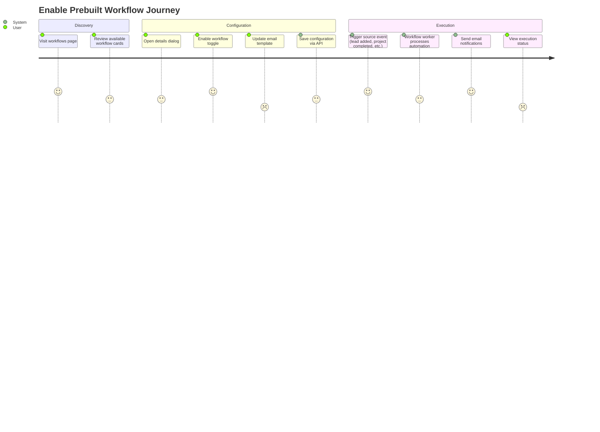
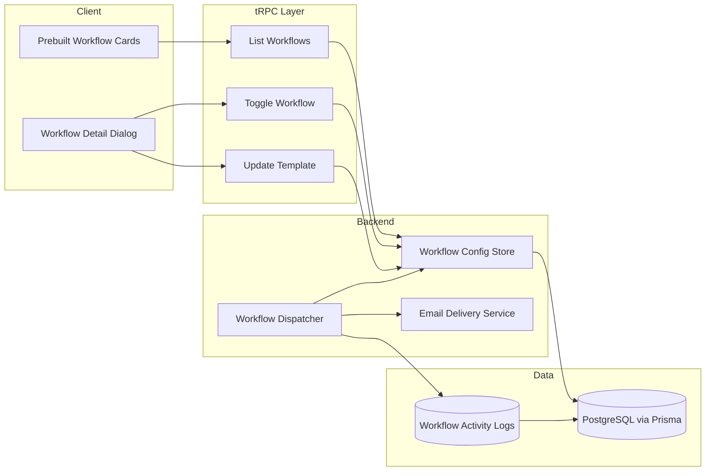

# Prebuilt Workflows Experience Design

> **Version:** 0.1  
> **Last Updated:** October 16, 2025  
> **Status:** Planning

## Table of Contents

- [Prebuilt Workflows Experience Design](#prebuilt-workflows-experience-design)
  - [Table of Contents](#table-of-contents)
  - [Purpose and Outcomes](#purpose-and-outcomes)
    - [Goals](#goals)
    - [Success Metrics](#success-metrics)
  - [Scope and Constraints](#scope-and-constraints)
    - [In Scope (Phase 1)](#in-scope-phase-1)
    - [Deferred / Out of Scope](#deferred--out-of-scope)
    - [Constraints](#constraints)
  - [Personas and User Journeys](#personas-and-user-journeys)
    - [Personas](#personas)
    - [Key Journey (Enable Prebuilt Workflow)](#key-journey-enable-prebuilt-workflow)
  - [High-Level Architecture](#high-level-architecture)
    - [Overview](#overview)
  - [Workflow Catalog](#workflow-catalog)
    - [Detail Dialog Content](#detail-dialog-content)
  - [User Experience](#user-experience)
    - [Layout](#layout)
    - [Email Template Editing](#email-template-editing)
    - [Accessibility](#accessibility)
    - [Feature Flag Strategy](#feature-flag-strategy)
  - [Backend and Services](#backend-and-services)
    - [tRPC Procedures (Proposed)](#trpc-procedures-proposed)
    - [Execution Pipeline](#execution-pipeline)
    - [Inter-module Coordination](#inter-module-coordination)
  - [Data Model Updates](#data-model-updates)
  - [RBAC and Security](#rbac-and-security)
  - [Observability and Monitoring](#observability-and-monitoring)
  - [Implementation Roadmap](#implementation-roadmap)
    - [Phase 0: Preparation (1 week)](#phase-0-preparation-1-week)
    - [Phase 1: UI and API Foundation (2 weeks)](#phase-1-ui-and-api-foundation-2-weeks)
    - [Phase 2: Workflow Execution (2 weeks)](#phase-2-workflow-execution-2-weeks)
    - [Phase 3: Hardening and Launch (1 week)](#phase-3-hardening-and-launch-1-week)
  - [Testing Strategy](#testing-strategy)
  - [Risks and Mitigations](#risks-and-mitigations)
  - [Open Questions](#open-questions)

---

## Purpose and Outcomes

### Goals

- Deliver a simplified workflows experience focused on curated, high-value automations.
- Replace the current workflow designer UI with prebuilt workflow cards that can be enabled or disabled.
- Allow organizations to customize email message templates per workflow while temporarily disabling SMS, Slack, and other channels.
- Provide clear telemetry on workflow adoption and performance.

### Success Metrics

- Workflow enablement rate: at least 60% of active organizations enable one or more prebuilt workflows within 30 days.
- Template customization rate: at least 40% of enabled workflows have customized email content.
- Support ticket reduction: 30% fewer tickets related to workflow builder complexity.
- Execution stability: 99% of scheduled workflow events complete without error.

---

## Scope and Constraints

### In Scope (Phase 1)

- Disable access to the legacy workflow designer UI and replace it with the prebuilt workflows surface.
- Display six curated workflow cards with enable/disable controls, status badges, and detail dialogs.
- Email-only automation channel with per-workflow email template editing using existing template storage mechanisms.
- tRPC endpoints for listing workflows, toggling status, and updating email templates.
- Execution pipeline changes to run only the enabled prebuilt workflows.

### Deferred / Out of Scope

- Custom workflow authoring, SMS, Slack, or webhook channels.
- Runtime editing of workflow logic or steps.
- Multi-step conditional branching and advanced scheduling beyond the curated set.
- Role-specific workflow variations.

### Constraints

- Maintain multi-tenant isolation and reuse existing RBAC primitives.
- Ensure backwards compatibility for workflow execution records; archived designer workflows should be disabled but retained in history for audit.
- Respect existing infrastructure choices (Bun runtime, Next.js 15, Prisma, tRPC, workflow dispatcher).

---

## Personas and User Journeys

### Personas

- **Operations Manager**: Needs reliable automation to keep client onboarding and invoicing consistent without manual setup.
- **Sales Lead**: Wants lead-to-client conversion automated with minimal configuration.
- **Finance Coordinator**: Relies on automated invoice reminders and renewal cycles.

### Key Journey (Enable Prebuilt Workflow)

1. User navigates to the Workflows page and sees the curated workflow grid.
2. User inspects a workflow card and opens the detail dialog for more information.
3. User toggles the workflow to enabled, reviews default email template, and optionally edits copy.
4. Changes persist via tRPC and the worker picks up the enabled workflow configuration.
5. Workflow executes when triggering events occur; user can monitor status within activity logs.



---

## High-Level Architecture

### Overview

- **Client**: Next.js route under `src/app/(dashboard)/[orgId]/workflows` renders workflow cards and detail dialogs. Legacy workflow designer components are removed or gated behind a feature flag defaulted to off.
- **tRPC API**: New router `src/server/api/routers/workflows/prebuilt.ts` exposes listing, enable/disable, and template update procedures.
- **Workflow Engine**: Existing workflow dispatcher is updated to reference prebuilt workflow definitions stored in code and database configuration (enabled flag, template overrides).
- **Email Service**: Reuse existing email templating utilities in `src/lib/email-templates.ts` with per-workflow overrides.



---

## Workflow Catalog

| Key   | Workflow                     | Trigger                 | Actions                                                                                   | Default Template Content              |
| ----- | ---------------------------- | ----------------------- | ----------------------------------------------------------------------------------------- | ------------------------------------- |
| WF-01 | Lead to Client Conversion    | New CRM lead            | Create client record, create project folder, trigger onboarding tasks, update lead stage  | Welcome email with onboarding summary |
| WF-02 | Client Onboarding            | New CRM client          | Generate contract template, assign default tasks, send internal notification              | Client welcome email with next steps  |
| WF-03 | Project Lifecycle            | New project             | Create task board, assign owner/team, transition statuses, generate invoice on completion | Project kickoff email                 |
| WF-04 | Invoice and Payment Tracking | Project marked complete | Create invoice, schedule payment reminders, close workflow when paid                      | Payment reminder email                |
| WF-05 | Contract Renewal / Retainer  | Contract renewal window | Alert at minus 15 days, send renewal email, draft invoice, update CRM upon confirmation   | Renewal reminder email                |
| WF-06 | Internal Health Dashboard    | Weekly schedule         | Aggregate metrics, send summary email every Friday                                        | Weekly operations digest              |

### Detail Dialog Content

- Workflow summary and benefits.
- Trigger definition, action chain, prerequisites.
- Email template editor (subject, body, optional variables).
- Enable/disable toggle with confirmation if dependencies exist (for example, invoice workflow depends on finance module access).
- Execution notes and RBAC requirements.

---

## User Experience

### Layout

- Replace workflow canvas with card grid layout (two-column desktop, single column on mobile).
- Each card shows workflow name, summary, status badge, enable toggle, and "View" button.
- Detail dialog uses responsive container with `max-h-[90vh] overflow-y-auto` and standard button layout guidelines.

### Email Template Editing

- Minimal rich-text editor (existing Markdown editor or textarea) limited to email content.
- Template preview section with placeholder variables (for example, `{{clientName}}`).
- Validation to ensure subject and body are not empty.

### Accessibility

- Keyboard navigation for toggles and dialogs.
- ARIA labels for workflow cards and actions.
- Color choices meeting contrast guidelines.

### Feature Flag Strategy

- Introduce `PREBUILT_WORKFLOWS_ENABLED` flag in UI and API to guard rollout.
- Legacy workflow designer path returns friendly message when flag is disabled.

---

## Backend and Services

### tRPC Procedures (Proposed)

| Procedure                | Input                                            | Output                                                                 | Notes                                          |
| ------------------------ | ------------------------------------------------ | ---------------------------------------------------------------------- | ---------------------------------------------- |
| `listPrebuiltWorkflows`  | `{ organizationId }`                             | Array of workflow definitions with enabled state and template metadata | Respects RBAC (`workflows:read`)               |
| `toggleWorkflow`         | `{ organizationId, workflowKey, enabled }`       | Updated state                                                          | Validates module dependencies and permissions  |
| `getWorkflowDetail`      | `{ organizationId, workflowKey }`                | Detailed configuration, template data, execution summary               | Used for dialog display                        |
| `updateWorkflowTemplate` | `{ organizationId, workflowKey, subject, body }` | Confirmation + version id                                              | Validates email content and persists to Prisma |
| `listWorkflowExecutions` | `{ organizationId, workflowKey, limit }`         | Recent execution records for future observability                      | Phase 2                                        |

### Execution Pipeline

- Prebuilt workflows defined as TypeScript modules under `src/workflows/prebuilt/` exporting metadata (key, triggers, action handler, default template).
- Worker jobs updated to resolve workflow by key and execute associated handler.
- Email sending uses `src/lib/email-templates.ts` with template overrides stored in database.
- Disable creation of new custom workflows through UI and block execution of legacy custom workflows by default (flag-driven fallback).

### Inter-module Coordination

- CRM tRPC router publishes events for lead/client creation.
- Finance router exposes invoice creation helper used by workflows.
- Projects router provides project creation and status change events.
- Shared event bus or dispatcher coordinates triggers; ensure idempotency.

---

## Data Model Updates

Minimal schema adjustments to capture prebuilt workflow configuration and template overrides.

```prisma
model PrebuiltWorkflowConfig {
  id              String   @id @default(cuid())
  organizationId  String
  workflowKey     String
  enabled         Boolean  @default(false)
  emailSubject    String
  emailBody       String
  templateVersion Int      @default(1)
  updatedByUserId String
  updatedAt       DateTime @updatedAt
  createdAt       DateTime @default(now())

  organization    Organization @relation(fields: [organizationId], references: [id])
  updatedBy       User          @relation(fields: [updatedByUserId], references: [id])

  @@unique([organizationId, workflowKey])
}
```

- Existing workflow execution logs can be reused; add `workflowKey` foreign key if not present.
- Store default templates in code; fall back to defaults when no override exists.

---

## RBAC and Security

- Require `workflows:read` permission to view workflows, `workflows:write` to enable/disable or edit templates.
- Ensure workflows interacting with other modules also validate module permissions (for example, invoice workflow requires `finance:write`).
- Audit log entries for toggle and template changes via existing logging utilities.
- Enforce HTML sanitization for template body to prevent script injection.

---

## Observability and Monitoring

- Metrics: workflows enabled per organization, execution counts per workflow, email send success rate, failure reasons.
- Logging: structured logs with workflow key, organization, trigger event, and outcome.
- Alerts: failure spike detection (errors above threshold within one hour), template rendering failures, event consumption lag.
- Dashboard: high-level view of workflow adoption, success rate, pending actions.

---

## Implementation Roadmap

### Phase 0: Preparation (1 week)

- Gate legacy workflow designer behind feature flag and add redirect message.
- Scaffold shared workflow metadata definitions and tRPC router skeleton.
- Define Prisma migration for `PrebuiltWorkflowConfig`.

### Phase 1: UI and API Foundation (2 weeks)

- Build workflow cards and detail dialog UI.
- Implement `listPrebuiltWorkflows`, `getWorkflowDetail`, `toggleWorkflow`, `updateWorkflowTemplate` procedures.
- Integrate email template editor with validation and persistence.

### Phase 2: Workflow Execution (2 weeks)

- Implement action handlers for six prebuilt workflows leveraging CRM, Projects, Finance services.
- Update dispatcher to respect enabled state and email templates.
- Add execution logging and minimal status reporting.

### Phase 3: Hardening and Launch (1 week)

- Comprehensive testing, performance checks, and rollout plan.
- Finalize monitoring dashboards and alert rules.
- Enable feature flag for pilot organizations, iterate on feedback, then roll out broadly.

---

## Testing Strategy

- **Unit Tests**: Workflow metadata loaders, template validation, toggle logic, email template rendering.
- **Integration Tests**: tRPC procedures with Prisma using organization-scoped fixtures; workflow execution handlers verifying side effects (client creation, invoice generation).
- **E2E Tests**: Playwright scenarios covering enabling workflows, editing templates, and verifying UI states.
- **Performance Tests**: Workflow execution throughput under concurrent triggers.
- **Security Tests**: RBAC enforcement, template sanitization, prevention of unauthorized module access.

---

## Risks and Mitigations

| Risk                                                      | Impact | Probability | Mitigation                                                                                         |
| --------------------------------------------------------- | ------ | ----------- | -------------------------------------------------------------------------------------------------- |
| Legacy workflows still executing unexpectedly             | High   | Medium      | Force-disable legacy workflows when prebuilt flag is active; add migration to archive old configs. |
| Insufficient module permissions causing workflow failures | Medium | Medium      | Validate dependencies during enablement and surface warnings.                                      |
| Email template misuse (invalid placeholders)              | Medium | High        | Provide linting and preview, block save on unresolved variables.                                   |
| User disappointment due to reduced flexibility            | Medium | Medium      | Offer clear messaging about upcoming custom builder v2 and collect feedback via telemetry.         |
| Workflow execution performance                            | High   | Low         | Reuse existing worker infrastructure, add targeted load tests.                                     |

---

## Open Questions

1. Should legacy workflow execution history remain visible in the new UI, or should it be migrated to a separate archive view?
2. Do we need per-workflow throttling controls (for example, limit emails per day) in the initial release?
3. Are there compliance requirements for weekly health emails (opt-out, audience restrictions)?
4. Should we allow different email templates per trigger event (for example, initial message vs reminder) in Phase 1?
